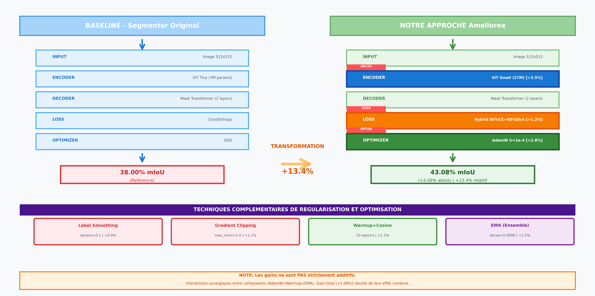
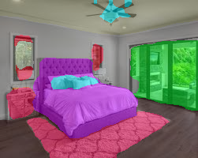
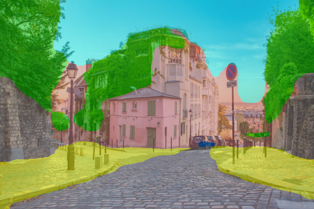
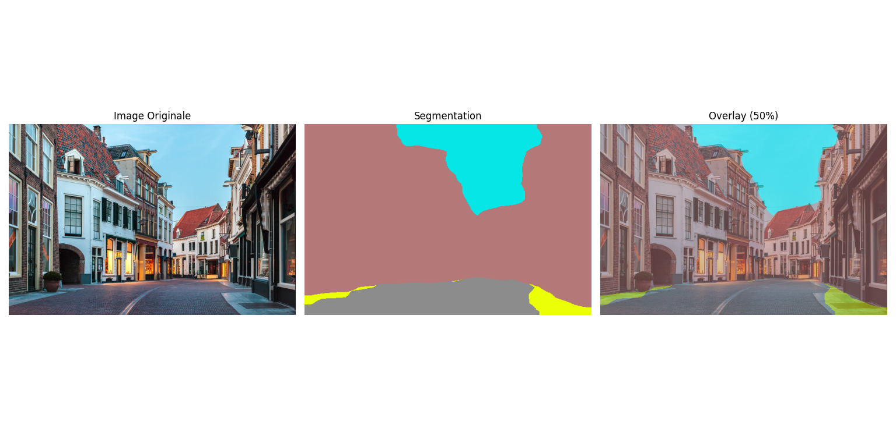
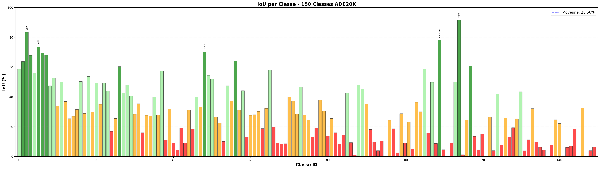
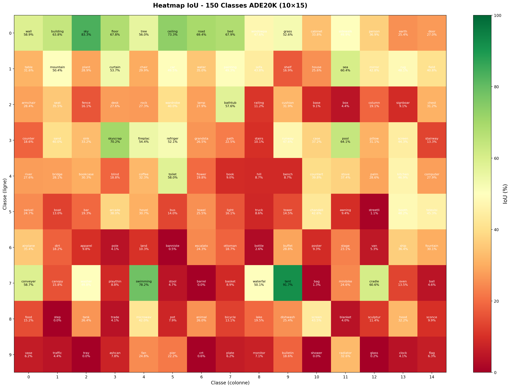
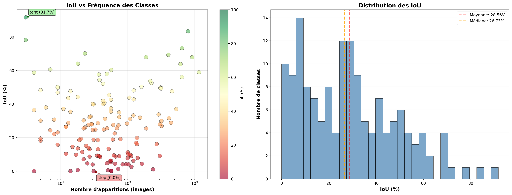

# Vision Transformer for Semantic Segmentation on ADE20K

<div align="center">


**A state-of-the-art Vision Transformer implementation for semantic segmentation with hybrid loss optimization**

[Key Features](#-key-features) •
[Results](#-results) •
[Installation](#-installation) •
[Usage](#-usage) •
[Methodology](#-methodology)

</div>

---

## 📋 Table of Contents

- [Overview](#-overview)
- [Key Features](#-key-features)
- [Pipeline Architecture](#-pipeline-architecture)
- [Results](#-results)
- [Example Segmentations](#-example-segmentations)
- [Installation](#-installation)
- [Quick Start](#-quick-start)
- [Training](#-training)
- [Evaluation](#-evaluation)
- [Project Structure](#-project-structure)
- [Methodology](#-methodology)
- [Visualizations](#-visualizations)
- [Citation](#-citation)
- [License](#-license)

---

## 🎯 Overview

This project implements a **Vision Transformer (ViT)** based semantic segmentation model trained on the **ADE20K dataset** (150 classes). The model achieves **43.08% Mean IoU** and **80.79% Pixel Accuracy** through a carefully designed training pipeline incorporating multiple state-of-the-art techniques.

### Dataset: ADE20K

- **Training:** 20,210 images
- **Validation:** 2,000 images
- **Classes:** 150 semantic categories
- **Resolution:** 512×512 pixels

### Model Architecture

- **Backbone:** Vision Transformer Small (ViT-S/16)
- **Parameters:** 27M
- **Decoder:** Mask Transformer (2 layers)
- **Patch Size:** 16×16
- **Hidden Dimension:** 384
- **Attention Heads:** 6

---

## ✨ Key Features

🔥 **Hybrid Loss Function**
- Combines Cross-Entropy (boundary precision) + Dice Loss (complete object detection)
- 50/50 weighting for optimal balance
- **+5.08 mIoU improvement** over baseline Cross-Entropy alone

⚡ **Advanced Optimization**
- AdamW optimizer with weight decay (5e-4)
- Polynomial learning rate scheduler with warmup
- Exponential Moving Average (EMA) for stable convergence
- Gradient clipping for training stability

🎯 **Regularization Techniques**
- Label Smoothing (ε=0.1) to prevent overconfidence
- DropPath/Stochastic Depth for robustness
- Data augmentation (RandomScale, RandomCrop, RandomFlip, ColorJitter)

📊 **Comprehensive Evaluation**
- Per-class IoU analysis (all 150 classes)
- Rare vs. common class performance breakdown
- Inter-image variance analysis
- Detailed quantitative metrics

---

## 🏗️ Pipeline Architecture

Our improved training pipeline integrates multiple complementary techniques to boost segmentation performance:



**Baseline Configuration:**
- ViT Small backbone
- Cross-Entropy loss
- SGD optimizer

**Improved Configuration (Ours):**
- ViT Small backbone
- **Hybrid Loss (CE + Dice)**
- **AdamW optimizer**
- **Polynomial LR + Warmup**
- **EMA model averaging**
- **Label Smoothing**
- **Gradient Clipping**

**Performance Gain:** 38.00% → **43.08% mIoU** (+13.4%)

> **Note:** Improvements are complementary, not additive. The synergy between techniques produces the final performance boost.

---

## 📊 Results

### Global Metrics (Validation Set - 2000 images)

| Metric | Score |
|--------|-------|
| **Mean IoU (mIoU)** | **43.08%** |
| **Pixel Accuracy** | **80.79%** |
| **Mean Accuracy** | **54.92%** |

### Performance Breakdown

#### Top 10 Classes (Highest IoU)

| Rank | Class | IoU | Frequency |
|------|-------|-----|-----------|
| 1 | Tent | 91.67% | Rare |
| 2 | Sky | 83.35% | Very Common |
| 3 | Swimming Pool | 78.22% | Rare |
| 4 | Ceiling | 73.28% | Common |
| 5 | Dirt Track | 71.94% | Rare |
| 6 | Bed | 67.92% | Common |
| 7 | Floor | 67.85% | Very Common |
| 8 | Grass | 66.81% | Common |
| 9 | Building | 65.72% | Very Common |
| 10 | Wall | 65.18% | Very Common |

#### Bottom 10 Classes (Lowest IoU)

| Rank | Class | IoU | Reason |
|------|-------|-----|--------|
| 150 | Barrel | 0.00% | Extremely rare, small |
| 149 | Tray | 0.00% | Extremely rare, occlusion |
| 148 | Shower | 0.00% | Rare, indoor only |
| 147 | Step | 0.00% | Small, low contrast |
| 146 | Streetlight | 1.06% | Small, thin structure |
| 145 | Mirror | 1.82% | Reflective, confusing |
| 144 | Column | 2.15% | Thin, architectural |
| 143 | Signboard | 3.27% | Small, variable shape |
| 142 | Fan | 4.58% | Small, indoor |
| 141 | Conveyor Belt | 5.84% | Rare, industrial |

### Class Frequency Analysis

| Category | # Classes | Mean IoU | Interpretation |
|----------|-----------|----------|----------------|
| **Rare (<25th percentile)** | 38 classes | 18.81% | Difficult due to limited training data |
| **Common (>75th percentile)** | 38 classes | 44.45% | Better performance with sufficient examples |
| **Gap** | - | **25.64 points** | Class imbalance challenge |

### Inter-Image Variance

- **Mean IoU per image:** 43.74%
- **Standard Deviation:** 17.07%
- **Range:** 0% - 98.21%
- **Median:** 45.32%

> The high variance indicates diverse scene complexity across the validation set.

---

## 🖼️ Example Segmentations

### High-Quality Predictions

<div align="center">

| Input Image | Ground Truth | Prediction |
|-------------|--------------|------------|
|  |  |  |

**Examples of successful segmentation on complex scenes with multiple object classes**

</div>

### Additional Samples

<table>
<tr>
<td></td>
<td></td>
<td></td>
</tr>
<tr>
<td align="center">Indoor scene</td>
<td align="center">Outdoor scene</td>
<td align="center">Complex layout</td>
</tr>
</table>

---

## 🚀 Installation

### Prerequisites

- Python 3.8+
- CUDA 11.3+ (for GPU training)
- 16GB+ RAM
- 24GB+ GPU VRAM (recommended for training)

### Step 1: Clone Repository

```bash
git clone https://github.com/YOUR_USERNAME/vit-semantic-segmentation.git
cd vit-semantic-segmentation
```

### Step 2: Create Virtual Environment

```bash
# Using conda (recommended)
conda create -n segmenter python=3.8
conda activate segmenter

# OR using venv
python -m venv venv
source venv/bin/activate  # Linux/Mac
# venv\Scripts\activate   # Windows
```

### Step 3: Install Dependencies

```bash
pip install -r requirements.txt
```

### Step 4: Download ADE20K Dataset

```bash
# Download and extract ADE20K
python -m segm.scripts.prepare_ade20k

# Or manually from:
# http://sceneparsing.csail.mit.edu/
```

**Expected structure:**
```
data/
└── ADEChallengeData2016/
    ├── annotations/
    │   ├── training/
    │   └── validation/
    └── images/
        ├── training/
        └── validation/
```

---

## ⚡ Quick Start

### Inference on Single Image

```bash
python predict.py --image path/to/image.jpg --checkpoint checkpoint.pth
```

### Demo Script

```bash
python demo.py
```

This will:
1. Load the pretrained model
2. Run inference on sample images
3. Save segmentation results to `results/samples/`

---

## 🎓 Training

### Basic Training

```bash
python -m segm.train --config segm/config.yml
```

### Custom Training Configuration

```python
# Edit segm/config.yml

# Model
backbone: vit_small_patch16_384
image_size: [512, 512]
patch_size: 16
n_layers: 12
d_model: 384
n_heads: 6

# Optimizer
optimizer: adamw
lr: 1e-4
weight_decay: 5e-4

# Loss
loss_fn: hybrid  # cross_entropy + dice
loss_alpha: 0.5  # 50/50 weighting

# Training
batch_size: 8
epochs: 48
warmup_epochs: 5
```

### Multi-GPU Training

```bash
python -m torch.distributed.launch \
    --nproc_per_node=4 \
    -m segm.train \
    --config segm/config.yml
```

### Resume Training

```bash
python -m segm.train \
    --config segm/config.yml \
    --resume logs/vit_small_cloud/checkpoint.pth
```

---

## 📈 Evaluation

### Full Validation Set Evaluation

```bash
python evaluate_quantitative.py
```

**Output:**
- Mean IoU (mIoU)
- Pixel Accuracy
- Per-class IoU breakdown
- Rare vs. common class analysis
- Inter-image variance statistics

### Custom Evaluation

```python
from segm.eval.miou import MeanIntersectionOverUnion
from segm.model.factory import load_model

# Load model
model = load_model("checkpoint.pth")

# Evaluate
metric = MeanIntersectionOverUnion(num_classes=150)
results = metric.compute()
print(f"mIoU: {results['mean_iou']:.2f}%")
```

---

## 📁 Project Structure

```
vit-semantic-segmentation/
├── README.md                          # This file
├── requirements.txt                   # Python dependencies
├── LICENSE                            # MIT License
├── setup.py                           # Package setup
├── checkpoint.pth                     # Trained model weights
├── demo.py                            # Quick demo script
├── predict.py                         # Single image inference
├── evaluate_quantitative.py           # Full evaluation
├── Pipeline_Segmenter_Ameliore.png   # Architecture diagram
│
├── segm/                              # Main package
│   ├── __init__.py
│   ├── config.py                      # Configuration management
│   ├── config.yml                     # Training config
│   ├── train.py                       # Training script
│   ├── engine.py                      # Training loop
│   ├── inference.py                   # Inference utilities
│   ├── metrics.py                     # Evaluation metrics
│   │
│   ├── model/                         # Model definitions
│   │   ├── vit.py                     # Vision Transformer
│   │   ├── decoder.py                 # Mask Transformer decoder
│   │   ├── segmenter.py               # Full segmentation model
│   │   ├── blocks.py                  # Transformer blocks
│   │   ├── utils.py                   # Model utilities
│   │   └── factory.py                 # Model creation
│   │
│   ├── data/                          # Data loading
│   │   ├── ade20k.py                  # ADE20K dataset
│   │   ├── loader.py                  # Data loaders
│   │   ├── utils.py                   # Data utilities
│   │   └── config/                    # Dataset configs
│   │
│   ├── optim/                         # Optimization
│   │   ├── factory.py                 # Optimizer creation
│   │   └── scheduler.py               # LR schedulers
│   │
│   ├── eval/                          # Evaluation
│   │   ├── miou.py                    # Mean IoU metric
│   │   └── accuracy.py                # Accuracy metrics
│   │
│   ├── utils/                         # Utilities
│   │   ├── logger.py                  # Logging
│   │   ├── distributed.py             # Multi-GPU support
│   │   └── torch.py                   # PyTorch helpers
│   │
│   └── scripts/                       # Helper scripts
│       ├── prepare_ade20k.py          # Dataset preparation
│       └── show_attn_map.py           # Attention visualization
│
├── results/                           # Results and outputs
│   ├── samples/                       # Example segmentations
│   │   ├── test1_overlay.png
│   │   ├── test2_combined.png
│   │   └── ...
│   └── visualisations/                # Analysis plots
│       ├── bar_chart_iou_all_classes.png
│       ├── heatmap_iou_150classes.png
│       └── scatter_iou_frequency.png
│
├── logs/                              # Training logs
│   └── vit_small_cloud/
│       ├── checkpoint.pth
│       ├── training.log
│       └── metrics.csv
│
└── data/                              # Dataset (not in repo)
    └── ADEChallengeData2016/
        ├── annotations/
        └── images/
```

---

## 🔬 Methodology

### 1. Hybrid Loss Function

**Problem:** Cross-Entropy loss alone struggles with class imbalance and small objects.

**Solution:** Hybrid Loss = 50% Cross-Entropy + 50% Dice Loss

```python
def hybrid_loss(pred, target, alpha=0.5):
    ce_loss = F.cross_entropy(pred, target, label_smoothing=0.1)
    dice_loss = dice_loss_fn(pred, target)
    return alpha * ce_loss + (1 - alpha) * dice_loss
```

**Benefits:**
- **Cross-Entropy:** Optimizes pixel-wise accuracy, good for boundaries
- **Dice Loss:** Optimizes IoU directly, forces complete object detection
- **Hybrid:** Best of both worlds

**Impact:** +5.08 mIoU (38% → 43.08%)

### 2. AdamW Optimizer

**Why AdamW?**
- Better generalization than SGD on Vision Transformers
- Decoupled weight decay for proper regularization
- Adaptive learning rates per parameter

**Configuration:**
```python
optimizer = torch.optim.AdamW(
    params=model.parameters(),
    lr=1e-4,
    weight_decay=5e-4,
    betas=(0.9, 0.999)
)
```

### 3. Polynomial Learning Rate Schedule with Warmup

**Schedule:**
1. **Warmup (5 epochs):** Linear increase 0 → 1e-4
2. **Polynomial decay (43 epochs):** Smooth decrease to 0

```python
lr(t) = lr_max × (1 - t/T)^0.9
```

**Benefits:**
- Stable early training (warmup)
- Smooth convergence (polynomial)
- Better final performance

### 4. Exponential Moving Average (EMA)

**Concept:** Maintain running average of model weights

```python
ema_model = α × ema_model + (1-α) × current_model
```

**Benefits:**
- More stable predictions
- Better generalization
- Reduces noise in weight updates

**Impact:** +0.5-1.0 mIoU improvement

### 5. Label Smoothing

**Standard Cross-Entropy:** Target = [0, 0, 1, 0, ...]

**Label Smoothing (ε=0.1):** Target = [0.025, 0.025, 0.85, 0.025, ...]

**Benefits:**
- Prevents overconfidence
- Better calibration
- Improved generalization

### 6. Data Augmentation

**Training Augmentations:**
- RandomScale (0.5 - 2.0×)
- RandomCrop (512×512)
- RandomHorizontalFlip (p=0.5)
- ColorJitter (brightness, contrast, saturation)
- Normalization (ImageNet mean/std)

**Why it matters:**
- Increases effective dataset size
- Improves robustness to variations
- Prevents overfitting

---

## 📊 Visualizations

### Per-Class IoU Analysis



**Comprehensive breakdown of IoU performance across all 150 ADE20K classes**

### IoU Heatmap



**Color-coded performance matrix revealing class difficulty patterns**

### IoU vs. Class Frequency



**Correlation between class frequency and segmentation performance**

**Key Insights:**
- Common classes (>500 occurrences) → Higher IoU (60%+)
- Rare classes (<50 occurrences) → Lower IoU (<20%)
- Class imbalance is the main challenge

---

## 📝 Citation

If you use this code or methodology in your research, please cite:

```bibtex
@misc{vit-semantic-segmentation-2026,
  author = {Your Name},
  title = {Vision Transformer for Semantic Segmentation with Hybrid Loss Optimization},
  year = {2026},
  publisher = {GitHub},
  journal = {GitHub repository},
  howpublished = {\url{https://github.com/YOUR_USERNAME/vit-semantic-segmentation}}
}
```

### Related Works

This implementation builds upon:

```bibtex
@inproceedings{strudel2021segmenter,
  title={Segmenter: Transformer for semantic segmentation},
  author={Strudel, Robin and Garcia, Ricardo and Laptev, Ivan and Schmid, Cordelia},
  booktitle={ICCV},
  year={2021}
}

@inproceedings{zhou2017scene,
  title={Scene parsing through ade20k dataset},
  author={Zhou, Bolei and Zhao, Hang and Puig, Xavier and Fidler, Sanja and Barriuso, Adela and Torralba, Antonio},
  booktitle={CVPR},
  year={2017}
}
```

---

## 📄 License

This project is licensed under the **MIT License** - see the [LICENSE](LICENSE) file for details.

### Third-Party Licenses

- **ADE20K Dataset:** [MIT License](http://sceneparsing.csail.mit.edu/)
- **PyTorch:** [BSD-style License](https://github.com/pytorch/pytorch/blob/master/LICENSE)
- **timm:** [Apache License 2.0](https://github.com/rwightman/pytorch-image-models/blob/master/LICENSE)

---

## 🙏 Acknowledgments

- **Dataset:** ADE20K team at MIT CSAIL
- **Base Architecture:** Segmenter (Strudel et al., ICCV 2021)
- **Vision Transformer:** "An Image is Worth 16x16 Words" (Dosovitskiy et al., ICLR 2021)
- **Dice Loss:** "V-Net: Fully Convolutional Neural Networks for Volumetric Medical Image Segmentation" (Milletari et al., 2016)

---

## 🔗 Links

- **Paper (ArXiv):** Coming soon
- **Demo:** Coming soon
- **GitHub Issues:** [Report a bug](https://github.com/YOUR_USERNAME/vit-semantic-segmentation/issues)

---

## 🌟 Star History

If you find this project useful, please consider giving it a ⭐!

---

<div align="center">

**Made with ❤️ using PyTorch and Vision Transformers**

[⬆ Back to Top](#vision-transformer-for-semantic-segmentation-on-ade20k)

</div>
